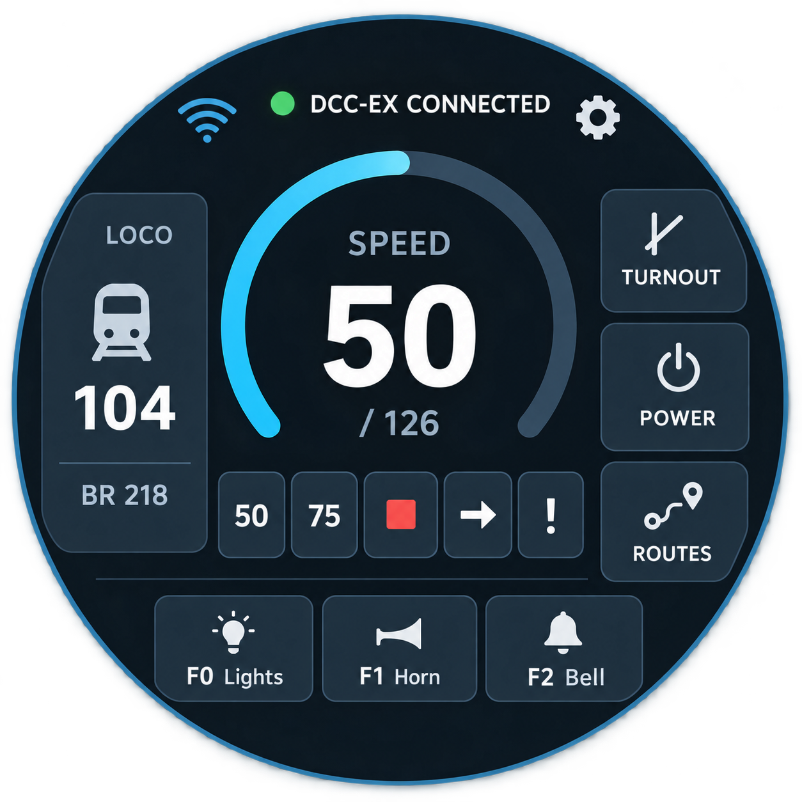
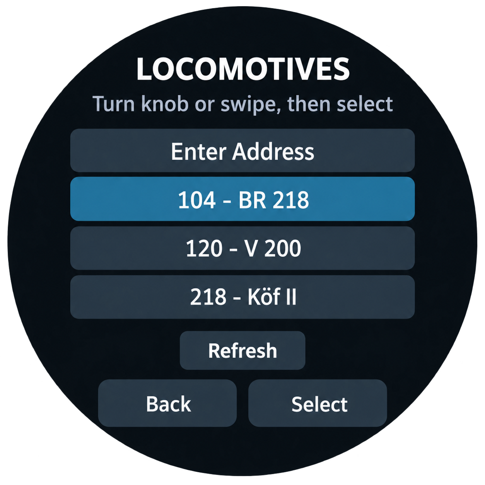
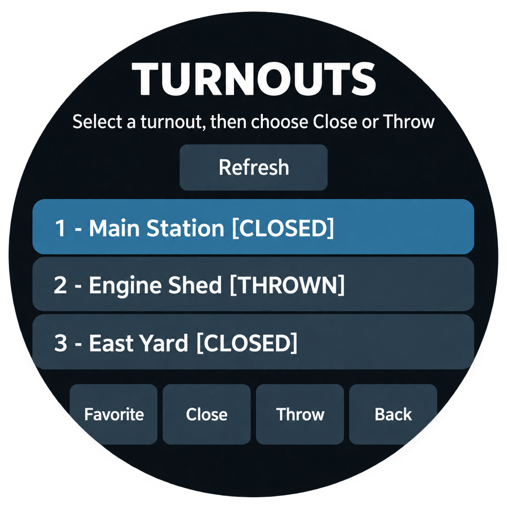

# CabDial — a round touchscreen throttle for DCC-EX

CabDial is a standalone touchscreen throttle for a DCC-EX Command Station.
It runs on an ESP32-S3 with the Viewe round
480 × 480 touchscreen and combines touch, a rotary encoder, and a physical
button in a compact controller.

The firmware connects over Wi-Fi to the Command Station's TCP interface. No
hard-coded Wi-Fi or Command Station address is required: connection details
are entered on the device and stored in ESP32 Preferences.

## Interface mockups

<p align="center">
  
  
  
</p>

Illustrations show the round-screen interface. Locomotive and turnout names
are examples.

## Features

- Touchscreen Wi-Fi network selection and password entry
- Automatic DCC-EX Command Station discovery through mDNS, with manual
  address and port entry when discovery finds no suitable station
- Saved Wi-Fi network, Command Station IP address, and port
- Connection status displayed on the throttle screen
- Home-screen DCC controls dimmed and disabled until the Command Station is
  ready
- Connection diagnostics for Wi-Fi, DCC-EX TCP, roster, turnout, and route
  loading state, including the age of the most recent DCC-EX reply
- Independent roster, turnout, and route list retries when a Command Station
  accepts TCP but leaves the normal ordered list load unanswered
- Speed control with the on-screen arc and rotary encoder
- 50 and 75 speed presets, selected-locomotive stop, direction, and global
  emergency-stop controls
- Locomotive selection from the DCC-EX roster
- Five-digit manual locomotive address entry for locomotives outside the roster,
  with independent digit controls and DCC's `1–10,239` address range
- Release action to clear the locomotive selected by this throttle
- Roster names and function definitions, including momentary functions
- Three large F0–F2 shortcut cards with text and recognised function
  pictograms, plus an F+ action in the locomotive card for additional
  functions through F31
- Per-locomotive function state retained while the throttle remains powered
- Synchronization of the selected locomotive's speed, direction, and function
  broadcasts from other throttles
- Turnout list, close/throw actions, turnout state broadcasts, and local
  favourite turnouts
- Route list and route start actions
- Track-power page with on/off state and confirmation before power-off
- Display-brightness and sleep-timeout settings saved as preferences
- Configurable single-, double-, and long-press physical-button shortcuts
  for F0, F1, F2, stop, direction, or emergency stop
- 180-degree display and touch rotation for the installed Viewe hardware
- Round-screen layout designed for the Viewe display

## Hardware

The current target is:

| Component | Supported hardware |
| --- | --- |
| MCU | ESP32-S3, `esp32s3_120_16_8-qio_opi` PlatformIO board |
| Display | Viewe UEDX48480021-MD80 round display |
| Touch controller | MD80ET |
| Encoder A | GPIO 6 |
| Encoder B | GPIO 5 |
| Encoder button | GPIO 0 |

The code has a `Device` abstraction, display profile, device factory, and
hardware-porting notes to prepare for additional boards and displays. The
Viewe device is the only implemented hardware target today. See
[hardware porting notes](docs/HARDWARE_PORTING.md).

## Build and upload

1. Install [PlatformIO](https://platformio.org/).
2. Clone this repository.
3. Connect the ESP32-S3 board by USB.
4. Build and upload:

   ```sh
   pio run -e esp32s3_120_16_8-qio_opi --target upload
   ```

5. Optionally open the serial monitor:

   ```sh
   pio device monitor -b 115200
   ```

On first startup, the connection screen scans for nearby Wi-Fi networks. After
Wi-Fi connects, it searches for DCC-EX Command Stations through mDNS. You can
also enter a Command Station address and port manually; DCC-EX normally uses
TCP port `2560`.

## First-time setup

1. Power the throttle. The connection screen opens when no saved connection is
   available.
2. Select the Wi-Fi network used by the DCC-EX Command Station and enter its
   password. The throttle connects as a normal Wi-Fi client.
3. Select a discovered Command Station. If none is listed, select **Manual
   connection** and enter its local IP address and TCP port, normally `2560`.
   The chosen connection details are stored for the next startup.
4. Wait for the connection indicator on the throttle screen to show that
   DCC-EX is connected. Until then, DCC controls are shown in dark gray and
   cannot be activated. If lists do not appear, open the connection screen and
   use **Refresh**. **DIAG** shows the individual Wi-Fi, TCP, roster, turnout,
   and route loading states.
5. Open the cog icon, select **Button Shortcuts**, and choose an action for
   single press, double press, and long press. Each can use F0, F1, F2, Stop,
   Change direction, or Emergency stop. The selections are saved immediately.

In locomotive, turnout, and route lists, a single physical-button press
selects the current entry and returns to the throttle. A double press returns
without making a selection.

## Controls

| Control | Action |
| --- | --- |
| Speed arc / encoder | Change selected locomotive speed |
| Locomotive card | Open roster and manual-address selection; displays the roster name when available |
| Locomotive list: Release | Clear the locomotive selected by this throttle |
| Manual address editor | Set each of five digits independently; valid addresses are `1–10,239` |
| Function cards | Toggle latching functions or hold momentary functions |
| F+ in the locomotive card | Open all available roster functions, or F0–F31 for a manual locomotive |
| Direction control | Stop and change direction |
| Stop | Stop the selected locomotive |
| `!` | Send a global DCC-EX emergency stop |
| TURNOUT | Open turnout control |
| POWER | Open track-power control |
| ROUTES | Open route control |
| Wi-Fi status tile | Open connection settings; shows setup, Wi-Fi, connecting, or online state |
| DIAG | Open live Wi-Fi, TCP, roster, turnout, and route diagnostics |
| Cog icon | Open display settings |

The encoder uses the ESP32-S3 PCNT hardware peripheral and can browse
locomotive, turnout, route, Wi-Fi-network, and Command-Station lists without
waiting for DCC/TCP processing. A single physical-button press uses the current
entry: it selects a locomotive, closes a turnout, starts a route, or advances
from a Wi-Fi or Command-Station picker. A double press returns without an
action. In the manual address editor, turning first moves focus among digits
and lower actions; press to edit the focused digit, turn to change it, and
press again to return to focus navigation. On the home screen, the single-,
double-, and long-press actions are configured under **Settings → Button
Shortcuts**.

## Limitations and current scope

- Only the Viewe ESP32-S3 round-screen hardware is implemented and tested.
- Function states are remembered per locomotive only for the current powered
  session. They are not saved across a restart.
- Incoming locomotive broadcasts update the selected locomotive directly;
  non-selected function maps are cached for later selection.
- Turnout favourites and display/connection settings are local to this
  throttle; they are not synchronized with other throttles.
- The app requires a DCC-EX Command Station that exposes its TCP protocol and
  supports the requested roster, turnout, route, and power commands.
- Some Command Station/network combinations may not answer the version request
  or object-list queries even though their TCP connection is usable. The
  throttle continues without a version reply and independently retries the
  roster, turnout, and route requests, but firmware and network compatibility
  should be checked on the target layout.
- This project has no automated hardware-in-the-loop test suite. On-device
  testing is required after changes to networking, input, or display code.

## Project structure

- `src/DccController.*` — DCC-EX protocol connection and application model
- `src/AppController.*` — application runtime, UI behavior, and input flow
- `src/*UI.*` — LVGL pages for throttle, locomotive selection, connection,
  diagnostics, turnouts, routes, power, display settings, and button shortcuts
- `src/Device.*` and `src/ViewEDevice.*` — board/display abstraction and the
  current Viewe implementation
- `docs/` — DCCEXProtocol references and hardware-porting notes

## Dependencies

The PlatformIO configuration installs LVGL 8.4, DCCEXProtocol, ESP32 Display
Panel, ESP32 Button, and their required ESP32 support libraries. Rotary
encoder decoding uses ESP-IDF's built-in PCNT peripheral rather than an
external encoder library.
See `platformio.ini` for exact sources.

## License

CabDial's original source code is licensed under the [MIT License](LICENSE).
See [THIRD_PARTY_NOTICES.md](THIRD_PARTY_NOTICES.md) for the licenses and
attributions that apply to its dependencies and derived source files.

### Third-party dependencies

CabDial uses third-party libraries and other dependencies. These dependencies
remain the property of their respective authors and retain their own licenses;
the license selected for CabDial does not replace or alter those licenses.
Refer to each dependency's source repository and license file for its terms.

#### DCCEXProtocol

CabDial uses [DCCEXProtocol](https://github.com/DCC-EX/DCCEXProtocol), developed
by the DCC-EX project. The DCCEXProtocol project credits Peter Akers
(Flash62au), Peter Cole (peteGSX), and Chris Harlow (UKBloke) for the library,
and notes that its delegate and connection code was taken from the WiThrottle
library by Blue Knobby Systems Inc.

DCCEXProtocol is licensed under the
[Creative Commons Attribution-ShareAlike 4.0 International (CC BY-SA 4.0)](https://creativecommons.org/licenses/by-sa/4.0/).

CabDial uses DCCEXProtocol as an external PlatformIO dependency and does not
include a modified copy of the DCCEXProtocol source code in this repository.
No modifications have been made to DCCEXProtocol by the CabDial project.


#### VIEWE UEDX48480021-MD80 LVGL/display port

CabDial contains an adapted LVGL/display port implementation derived from the
[VIEWE UEDX48480021-MD80 example repository](https://github.com/VIEWESMART/UEDX48480021-MD80ESP32-2.1inch-Touch-Knob-Display).

Unlike DCCEXProtocol, this code is not used solely as an external dependency.
The relevant VIEWE/Espressif LVGL port helper code has been adapted and modified
for CabDial and is included in this repository under `lib/VieweLvglPort/`.

The original copyright, SPDX, attribution, and license notices in the derived
source files are retained. Those files remain subject to their applicable
upstream license terms; CabDial's own license does not replace or alter those
terms.
